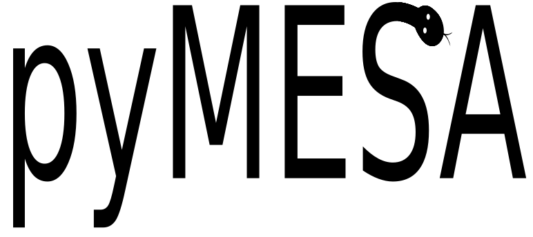

[](https://zenodo.org/badge/latestdoi/98320319)


# pyMesa
Allows python to interface with MESA stellar evolution code.


## Requirements:
Note: pyMesa currently only works on linux, Macs will fail to build.

Python dependencies can be installed with:

``
python -m pip install -r requirements.txt
``

We also need the following tool from installed by you system package manager or other means:

``
chrpath
`` 


## Installing pyMesa

The preferred way is via pip:

``
python -m pip install --upgrade pyMesa
``


## Building MESA

Go to ``$MESA_DIR/utils/makefile_header`` and find ``USE_SHARED=no`` and switch that to ``USE_SHARED=yes``

Then:

````
cd $MESA_DIR
./clean
./install
````


## Supported MESA versions

Any post github version: that is a version that starts with 'r2' or is from a git checkout.


## Running

Make sure you set ``MESA_DIR`` and ``MESASDK_ROOT`` before starting Python.


## Usage

Here is a basic example of talking to the ``const`` module.

````python
import pyMesa as pym

# pyMesa module defines a number of useful MESA paths as pym.SOMETHING.
print(pym.MESA_DIR) # Print MESA_DIR

# Loads the const module
const_lib,const_def = pym.loadMod("const")

# When calling a function we must either set the value we want (for intent(in/inout) variables) or an empty variable for intent(out).
ierr=0
# Calls a function
res = const_lib.const_init(pym.MESA_DIR,ierr)


# If the call was a subroutine then res is a dict with the intent out variables in there
# else it contains the result of the function call

# Accessing a variable defined in a module is simply:
const_def.mev_to_ergs

# If the variable is not a parameter then you can change it with:
const_def.standard_cgrav = 5.0

# When passing a derived type, you should pass a dict to the function (filled with anything you want set)
x = {}
# or
x = {'a':1,'b':'abc','c':{'d':1}}

# Functions accepting arrays should pass a numpy array of the size it expects (if the function allocates the array, then just pass None)
x = np.zeros(size)

````

The folder ``mesa_models`` shows some examples of accessing different MESA modules. Note some may not work depending on whether MESA 
has changed the interface since the code was written.

## Procedure calls

Calling a function or a subroutine is handled the same way:

````python
result = module.my_function(arg1, arg2)
````

Where every arg should be provided either with the value to be inputted (intent(in) or intent(inout)) or a dummy empty provided for intent(out) values.

The result of a procedure call is returned as a NamedTuple of ``(result, args)``. Thus a function result is accessed via:

````python
result = module.my_function(arg1, arg2)

#Function result
result.result
````

While all the arguments (both those that change and those that don't) are returned via:

````python
result = module.my_function(arg1, arg2)

#Arguments
result.args['arg1']
result.args['arg2']
````

## Arrays

Remember that Fortran has 1-based arrays while Numpy uses 0-based. This comes
up if you're accessing an array via a mesa constant:

````python
mesa_array[mesa_module.i_mesa_const]
````
 should instead be accessed as:
 
 ````python
mesa_array[mesa_module.i_mesa_const-1]
````

## Bug reports:

Bug reports should go to the issue tracker on github. Please include mesa version, gfortran version, gfort2py version and pyMesa version 

## Contributing

In general, most of the development should go towards the gfort2py project to add new
fortran features. This repository just handles building mesa for Python support. 

Bug reports, if mesa versions don't work, or new examples are welcome as either pull requests
or issues on the GitHub tracker.

## Citations

People who use pyMESA in papers should cite this using the zenodo link for the version they used. If you use pyMesa in a project (research or teaching), let me know and i can help advertise here (also useful for me to help
with funding requests). The current version's citation is in the CITATION file.

## Known Projects using pyMesa

[Poelarends et al 2017](https://ui.adsabs.harvard.edu/#abs/2017ApJ...850..197P/abstract)


